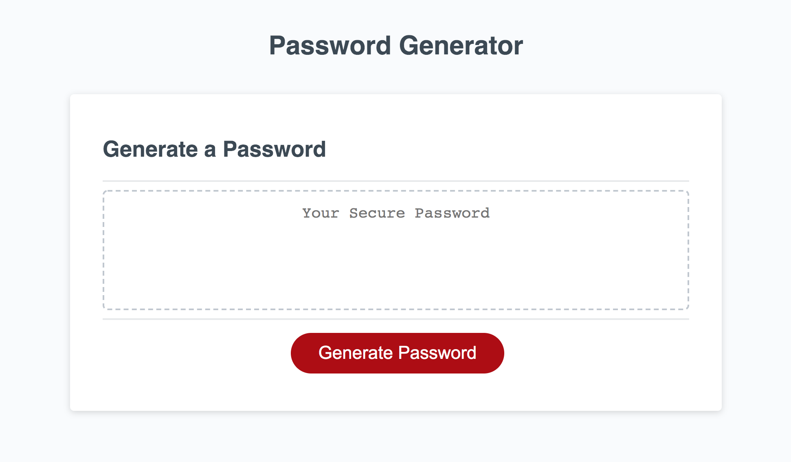

## Password Generator Overview
This application generates a random password based on user-selected criteria. It features dynamically updated HTML and CSS powered by JavaScript. 

## Use case
This can be used by an employee or individual with access to sensitive business or personal data who wants to create a password that meets certain criteria. This would help provide greater security. Multi-factor authentication processes can be built around this as well.

## Acceptance Criteria
GIVEN I need a new, secure password 
WHEN I click the button to generate a password 
THEN I am presented with a series of prompts for password criteria 
WHEN prompted for password criteria 
THEN I select which criteria to include in the password 
WHEN prompted for the length of the password 
THEN I choose a length of at least 8 characters and no more than 128 characters 
WHEN prompted for character types to include in the password 
THEN I choose lowercase, uppercase, numeric, and/or special characters 
WHEN I answer each prompt 
THEN my input should is validated and at least one character type should be selected 
WHEN all prompts are answered 
THEN a password is generated that matches the selected criteria 
WHEN the password is generated 
THEN the password is either displayed to the page 

## Links
Link to Github: https://github.com/Bscott95/homework3 
Link to Web App: https://bscott95.github.io/homework3/

## Screenshot

